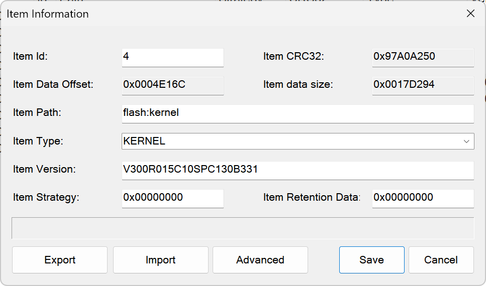

# HWFW_GUI
HuaWei ONT Firmware Editor - GUI

Screenshots
-------

ChangeLog
-------
### 1.0.9 Beta Build 001
- Added auto-fitting for all columns
- Modified all Chinese text to English

### 1.0.8 Beta Build 005
- Modified the project size determination rules when exporting sub-projects
- Fixed a crash when deleting a subproject

### 1.0.8 Alpha Build 002
- Added product list editing functionality
- Added support for sub-project parsing for R018 and R019
- Added support for sub-project alignment for V5 firmware
- Bug fixes

### 1.0.4 Alpha Build 001
- Added the function of browsing supported product models

### 1.0.3 Alpha Build 003
- Added advanced data format editing features
- Minor fixes
- Code indentation optimization

Donate
-------
If this software is helpful to you, please consider donating to the author to support its continued development!

License
-------

Copyright (C) 2019 csersoft

This program is free software: you can redistribute it and/or modify
it under the terms of the GNU General Public License as published by
the Free Software Foundation, either version 3 of the License, or
(at your option) any later version.

This program is distributed in the hope that it will be useful,
but WITHOUT ANY WARRANTY; without even the implied warranty of
MERCHANTABILITY or FITNESS FOR A PARTICULAR PURPOSE.  See the
GNU General Public License for more details.

You should have received a copy of the GNU General Public License
along with this program.  If not, see <http://www.gnu.org/licenses/>.
